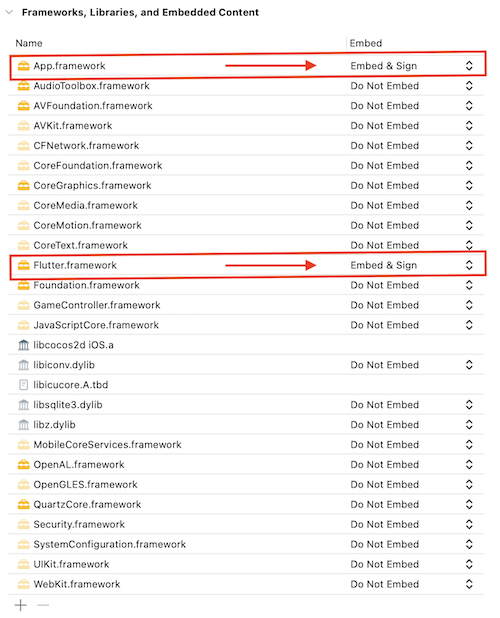
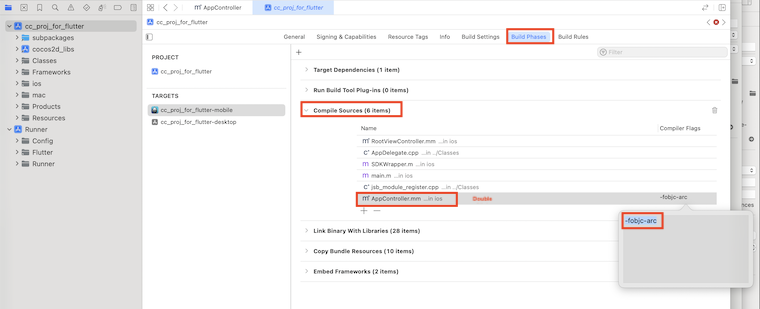

# Flutter + Cocos2d-x Integration Guide (iOS)

This guide walks you through integrating a **Flutter application** with a **Cocos2d-x (v2.1.3) iOS game**, allowing you to launch the Flutter UI first, and transition to Cocos2d-x game logic from Flutter.

---

## ✅ Prerequisites

- macOS with Xcode installed (latest version recommended)
- Homebrew installed

---

## 1. Install Flutter by running below command 

```bash
brew install --cask flutter
```


Add Flutter to your shell environment:

```bash
echo 'export PATH="$PATH:`flutter doctor --android-licenses`"' >> ~/.zshrc
source ~/.zshrc
```

Verify Flutter is installed:

```bash
flutter doctor
```


---

## 2. Install Cocos2d-x

Install Cocos 2.1.3 [you can use custom engine]

---

## 3. Create Flutter Application and Build for iOS

Create Flutter app:
Open the terminal at where you want to create the project and run below command

```bash
flutter create flutter_app
cd flutter_app
```

here `flutter_app` is the project name, you can choose your own project name

Update `main.dart` to include a button that triggers native call:

`main.dart` will be located at `flutter_app/lib/main.dart`

```dart
import 'package:flutter/material.dart';
import 'package:flutter/services.dart';

class MyHomePage extends StatelessWidget {
  static const platform = MethodChannel('cocos_bridge');

  void launchCocosGame() async {
    try {
      await platform.invokeMethod('launchCocos');
    } catch (e) {
      print('❌ Failed to launch Cocos: \$e');
    }
  }

  @override
  Widget build(BuildContext context) {
    return Scaffold(
      appBar: AppBar(title: Text("Flutter UI")),
      body: Center(
        child: ElevatedButton(
          onPressed: launchCocosGame,
          child: Text("Launch Cocos Game"),
        ),
      ),
    );
  }
}

void main() => runApp(MaterialApp(home: MyHomePage()));
```

This Flutter code creates a simple UI with a button labeled "Launch Cocos Game."
When the button is tapped, it sends a message over a platform channel (cocos_bridge) to the native iOS code using MethodChannel.


Then build for iOS:
```bash
flutter build ios 
```

Navigate to:
```
flutter_app/build/ios/Release-iphoneos/
```
Locate `App.framework` and `Flutter.framework`.

---

## 4. Build Cocos2d-x Game for iOS

Navigate to your project and locate `cc_proj_for_flutter.xcodeproj` file
```bash
/cc_proj_for_flutter/build/jsb-default/frameworks/runtime-src/proj.ios_mac/
```
Open `cc_proj_for_flutter.xcodeproj` and ensure it builds successfully for a simulator or device.

---

## 5. Create Workspace and Add Both Projects

1. Open Xcode
2. Create new workspace 
Goto File->New->Workspace, give a name for the file eg: `FlutterCocosLauncher.xcworkspace`

3. Drag the following projects into the workspace:
   - `flutter_app/ios/Runner.xcodeproj`
   - `cc_proj_for_flutter/build/jsb-default/frameworks/runtime-src/proj.ios_mac/cc_proj_for_flutter.xcodeproj`

---

## 6. Add Frameworks to Cocos Project

1. Select `cc_proj_for_flutter` in xcode,make sure TARGETS selected as `cc_proj_for_flutter-mobile` 
2. Select `General` tab, Expand `Frameworks, Libraries, and Embedded Contents` 
3. Press `+` Symbol


4. Click on Dropdown Option `Add Other..` then select `Add Files`


5. Navigate to `flutter_app/build/ios/Release-iphoneos/` and select both `App.framework` and `Flutter.framework`. Then click Open


6. Make sure to mark `App.framework` and `Flutter.framework` as `Embed & Sign`. Please refer below screenshot


---

## 7. Set Framework Search Path

1. Select `cc_proj_for_flutter` in xcode,make sure TARGETS selected as `cc_proj_for_flutter-mobile`

2. Select `Build Settings` tab, And Search for `Framework Search Path`

3. Double Click on Value Area of `Framework Search Path` to open the Pop up


4. Click on `+` Symbol to add the path

5. Set the value to the path : `<from root folder>/flutter_app/build/ios/Release-iphoneos/`

6. Set as `recursive`


---

## 8. Update Runpath Search Paths

1. Select `cc_proj_for_flutter` in xcode,make sure TARGETS selected as `cc_proj_for_flutter-mobile`

2. Select `Build Settings` tab, And Search for `Runpath Search Path`

3. Double Click on Value Area of `Runpath Search Path` to open the Pop up

4. Click on `+` Symbol to add values

5. Replace all the values with below values
```
@executable_path/Frameworks
@loader_path/Frameworks
```


---

## 9. Set `-fobjc-arc` for `AppController.mm`

1. Select `cc_proj_for_flutter` in xcode,make sure TARGETS selected as `cc_proj_for_flutter-mobile`

2. Select `Build Phases` tab, And Expand `Compiler Sources`

3. Double click on `AppController.mm`, then enter below value to the pop up

```
-fobjc-arc
```



✅ This ensures ARC is enabled for that file.

---

## 10. Update `AppController.mm` to Launch Flutter and Switch to Cocos

1. Expand `cc_proj_for_flutter` on the left Nav bar, and goto `ios` folder

2. Open `AppController.mm` file, and Add below Lines to this file

```objc
#import <Flutter/Flutter.h>
```

```objc
FlutterEngine* flutterEngine = nil;
```

Then Replace `didFinishLaunchingWithOptions` function with below code

```objc
- (BOOL)application:(UIApplication *)application didFinishLaunchingWithOptions:(NSDictionary *)launchOptions {
    [[SDKWrapper getInstance] application:application didFinishLaunchingWithOptions:launchOptions];
    
    CGRect bounds = [[UIScreen mainScreen] bounds];
    window = [[UIWindow alloc] initWithFrame:bounds];
    
    // 🔥 Initialize Flutter engine
    flutterEngine = [[FlutterEngine alloc] initWithName:@"my_flutter_engine"];
    [flutterEngine runWithEntrypoint:nil];
    // [GeneratedPluginRegistrant registerWithRegistry:flutterEngine]; // Only needed if using plugins
    
    // 🔥 Show Flutter view controller first
    FlutterViewController* flutterVC = [[FlutterViewController alloc] initWithEngine:flutterEngine nibName:nil bundle:nil];
    window.rootViewController = flutterVC;
    [window makeKeyAndVisible];

    // ✅ Declare weakSelf INSIDE the method, but OUTSIDE the block
    __weak __typeof(self) weakSelf = self;

    
    // 🔁 Add MethodChannel to receive 'launchCocos' from Dart
    FlutterMethodChannel* channel = [FlutterMethodChannel methodChannelWithName:@"cocos_bridge" binaryMessenger:flutterVC.binaryMessenger];

    [channel setMethodCallHandler:^(FlutterMethodCall* call, FlutterResult result) {
        if ([call.method isEqualToString:@"launchCocos"]) {
            NSLog(@"🎮 Received 'launchCocos' from Flutter. Launching Cocos game...");
            [weakSelf showCocosGame];
            result(@"Cocos started");
        } else {
            result(FlutterMethodNotImplemented);
        }
    }];
    
    return YES;
}
```

Add the `showCocosGame` method at the bottom, just before `@end`

```objc
- (void)showCocosGame {
    float scale = [[UIScreen mainScreen] scale];
    CGRect bounds = [[UIScreen mainScreen] bounds];

    // Initialize Cocos2d-x game
    app = new AppDelegate(bounds.size.width * scale, bounds.size.height * scale);
    app->setMultitouch(true);

    _viewController = [[RootViewController alloc]init];

#ifdef NSFoundationVersionNumber_iOS_7_0
    _viewController.automaticallyAdjustsScrollViewInsets = NO;
    _viewController.extendedLayoutIncludesOpaqueBars = NO;
    _viewController.edgesForExtendedLayout = UIRectEdgeAll;
#else
    _viewController.wantsFullScreenLayout = YES;
#endif

    // Set Cocos view controller as root
    window.rootViewController = _viewController;
    [window makeKeyAndVisible];
    [[UIApplication sharedApplication] setStatusBarHidden:YES];

    app->start();
}
```

---

## 10. Final Step is to run `cc_proj_for_flutter` to your Device

1. Select `cc_proj_for_flutter` in xcode,make sure TARGETS selected as `cc_proj_for_flutter-mobile`

2. Make sure the Run target also selected as `cc_proj_for_flutter`, Then select your device

3. Make sure there are no Signing errors

4. Hit Play button to run the build


---

## ✅ Final Outcome
- App launches with Flutter UI
- When user taps `Launch Cocos Game` button in Flutter → calls native method → switches to full Cocos2d-x game mode

## ✅ Name References
**Cocos Project name : `cc_proj_for_flutter`**

**Flutter Project name : `flutter_app`**
